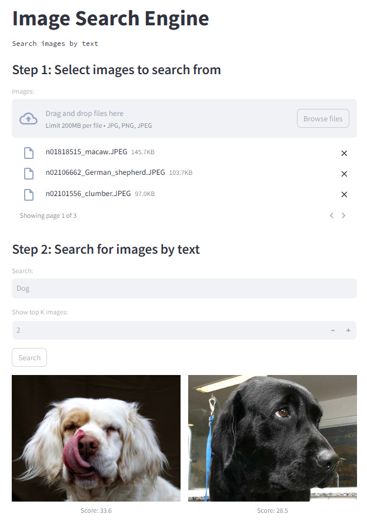

# Image_Search

Search for images by text.



### Installation
To run the app locally, install libraries
```
pip install -r requirements.txt
```

### Run
Run Streamlit app locally
```
streamlit run app.py
```

### Functionality
- Upload imagees to search from
- Search images by text
- Display search resuls and similarity scores