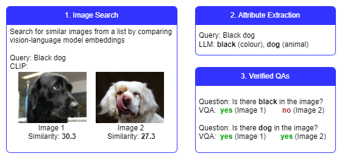

# Image_Search

Dajango app to search for images by text.


The overall workflow is illustrated below. Search results are ranked by similarity between text and image embeddings. Top images are evaluated by asking and answering questions about it with the power of large language models and visual question answering models.



### Installation
To run the app locally, install the libraries
```
pip install -r requirements.txt
```

### Run
Run migrations
```
python manage.py migrate
```

Start the development server
```
python manage.py runserver
```

### Functionality
- Users can upload multiple images.
- They can search through the uploaded images using text queries.
- They can specify how many top results to show.
- Results are displayed in a grid with their similarity scores and matched attributes.